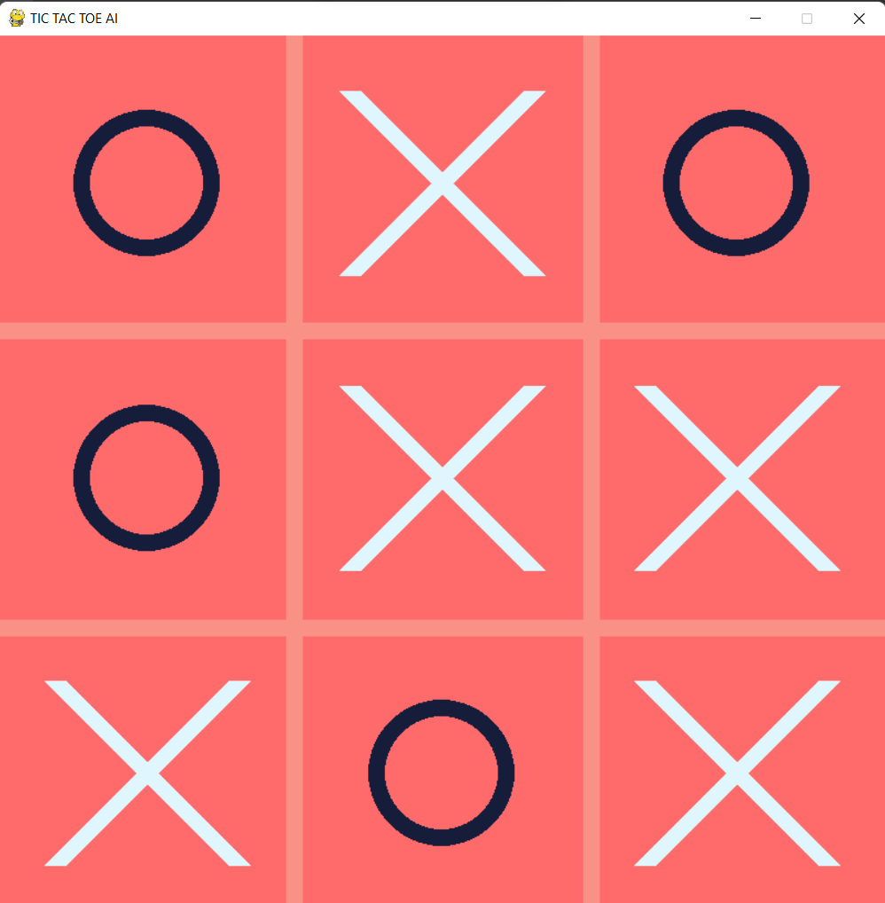

# Tic-Tac-Toe-using-Min-Max-algorithm
This is a game created using pygame and min-max algorithm in AI.

Inspired by the code by Alejandro (AlejoG10)

If you change self.player to 2 then the ai starts the game.

## Game Instructions

- press 'g' to change gamemode (player vs player or ai)
- press '0' for ai level 0 (ai selects random squares)
- press '1' for ai level 1 (ai selects squares according to min-max algorithm) : Impossible to defeat :-)
- press 'r' to reset the game

## GIFS

### GIF 1 - Cross Wins

### GIF 2 - Circle Wins

### GIF 3 - Draw

## Game Snapshots

### Snapshot 1 - Start

### Snapshot 2 - Circle Win

### Snapshot 3 - Cross Win

### Snapshot 3 - Draw

